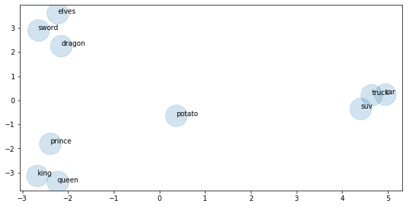

# Word Vectors

Word vectors represent a significant leap forward in advancing our ability to analyze relationships across words, sentences, and documents. It is word vectors that make technologies such as speech recognition and machine translation possible. **Word vectors are simply vectors of numbers that represent the meaning of a word.**   
http://jalammar.github.io/illustrated-word2vec/


This is a word embedding for the word “king” (GloVe vector trained on Wikipedia):
```
[ 0.50451 , 0.68607 , -0.59517 , -0.022801, 0.60046 , -0.13498 , -0.08813 , 0.47377 , -0.61798 , -0.31012 , -0.076666, 1.493 , -0.034189, -0.98173 , 0.68229 , 0.81722 , -0.51874 , -0.31503 , -0.55809 , 0.66421 , 0.1961 , -0.13495 , -0.11476 , -0.30344 , 0.41177 , -2.223 , -1.0756 , -1.0783 , -0.34354 , 0.33505 , 1.9927 , -0.04234 , -0.64319 , 0.71125 , 0.49159 , 0.16754 , 0.34344 , -0.25663 , -0.8523 , 0.1661 , 0.40102 , 1.1685 , -1.0137 , -0.21585 , -0.15155 , 0.78321 , -0.91241 , -1.6106 , -0.64426 , -0.51042 ]
```

It’s a list of 50 numbers. We can’t tell much by looking at the values. But let’s visualize it a bit so we can compare it other word vectors. Let’s color code the cells based on their values (red if they’re close to 2, white if they’re close to 0, blue if they’re close to -2). 

See how “Man” and “Woman” are much more similar to each other than either of them is to “king”? This tells you something. These vector representations capture quite a bit of the information/meaning/associations of these words.


In this lesson, we'll try working with some word vectors of our own, and seeing how we can combine them with a technique called Principle Components Analysis (PCA) in order to learn something about their meanings.


